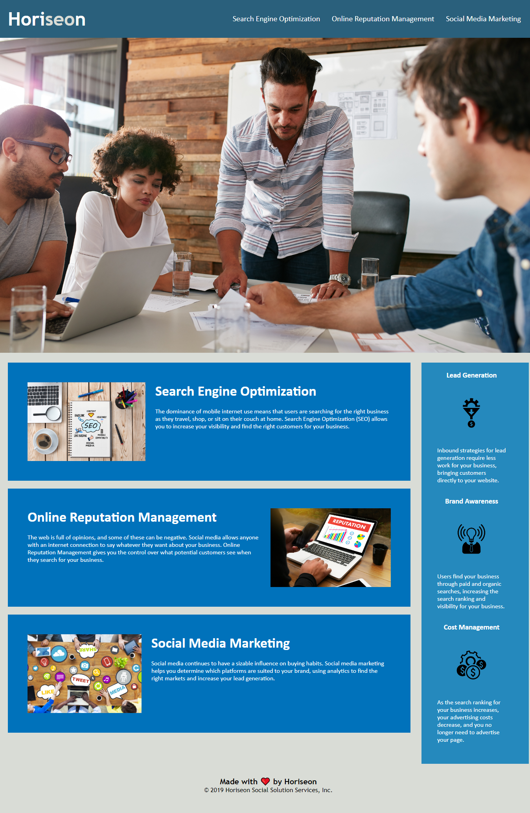

# Module-01-Weekly-Challenge

## User Story:

* AS A marketing agency
* I WANT a codebase that follows accessibility standards
* SO THAT our own site is optimized for search engines

## Acceptance Criteria:

* GIVEN a webpage meets accessibility standards
* WHEN I view the source code
* THEN I find semantic HTML elements
* WHEN I view the structure of the HTML elements
* THEN I find that the elements follow a logical structure independent of styling and positioning
* WHEN I view the icon and image elements
* THEN I find accessible alt attributes
* WHEN I view the heading attributes
* THEN they fall in sequential order
* WHEN I view the title element
* THEN I find a concise, descriptive title

## Summary:

I was provided a marketing agency's code and am directed to refactor it. By looking at the code, i replaced a lot
of non-semantic elements with semantic elements to make the code easier to follow. I also cleaned up and condensed 
code in the style.css file. In it's entirety, this helped eliminate a lot of excess code and make it easier to track.

The code was then pushed to GitHub, and deployed to a live page. A link to the live page can be found below:

## Live Page: https://lucasz10.github.io/Module-01-Weekly-Challenge/

